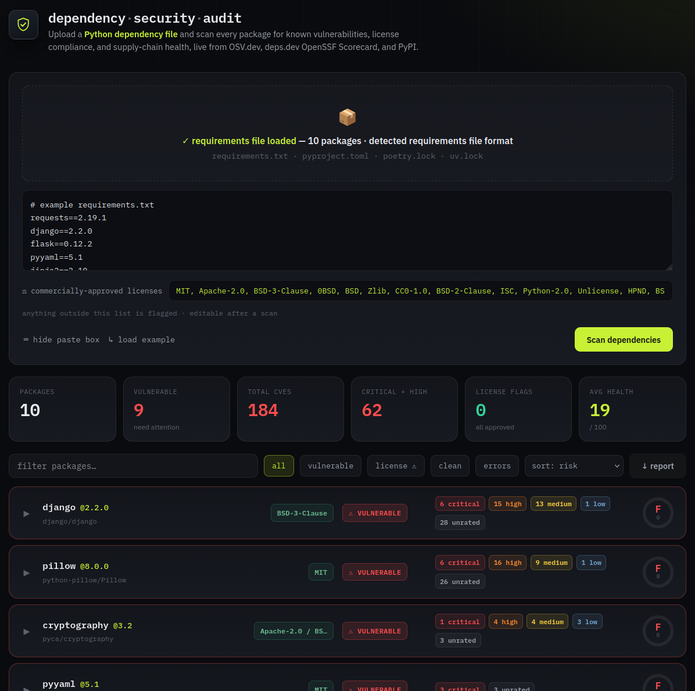

# Dependency Security Audit

A single-file web tool that audits the dependencies of a Python project for known
vulnerabilities, license compliance, and supply-chain health. No install, no backend,
no API keys. Open one HTML file in a browser, drop in a dependency file, and review
the results in a dashboard.

<!-- Add a screenshot here, e.g. docs/screenshot.png -->

## Features

- **Vulnerability scan.** Every package is checked against the OSV.dev database.
  Each finding shows the advisory id (GHSA / CVE / PYSEC), a CVSS 3.x severity,
  the affected version range, the version the fix landed in, and reference links.
- **License compliance.** Each package's license is resolved and checked against an
  editable policy of commercially permissive licenses. Anything outside the policy is
  flagged.
- **Supply-chain health.** A 0 to 100 health score per package, plus the OpenSSF
  Scorecard breakdown from deps.dev when the source repository is known.
- **Multiple input formats.** `requirements.txt`, `pyproject.toml`, `poetry.lock`,
  and `uv.lock` are all supported. The format is detected automatically.
- **Dashboard.** Summary cards, live filtering (vulnerable, license, clean, errors),
  sorting by risk or health, and a per-package detail view.
- **JSON report export** for sharing or archiving an audit.
- **Runs entirely in the browser.** One self-contained HTML file, no server, no build
  step, no dependencies.

## Quick start

1. Download `dependency-security-audit.html` (or clone this repository).
2. Open it in any modern browser. There is nothing to install.
3. Optionally adjust the approved license list in the policy field.
4. Drop your dependency file onto the page, or paste its contents.
5. Click **Scan dependencies**.

There is also a **load example** button to try the tool with a sample file.

## Supported files

| File | Notes |
| --- | --- |
| `requirements.txt`, `requirements-*.txt` | Standard pip format. Handles `==`, `>=`, `~=`, extras, environment markers, and comments. |
| `pyproject.toml` | PEP 621 `dependencies` and `optional-dependencies`, PEP 735 `dependency-groups`, and Poetry dependency tables. Build-system requirements are excluded. |
| `poetry.lock` | Exact resolved versions. |
| `uv.lock` | Exact resolved versions. |

The format is detected from the file content, so upload and paste both work.

## What it checks

### Security

For each package the tool queries [OSV.dev](https://osv.dev), which aggregates the
GitHub Advisory Database, PySEC, and other advisory sources. Severity is computed from
the CVSS vector when one is published (Critical 9.0+, High 7.0 to 8.9, Medium 4.0 to
6.9, Low below 4.0), and falls back to the advisory's qualitative rating otherwise.

### Licenses

A package's license is resolved from PyPI's SPDX license expression, its OSI
classifiers, or the license text, then compared against your policy. Each package gets
one of three outcomes:

- **Approved**: the license is on your policy list.
- **Review**: permissive but not on your list, or the license could not be verified.
- **Flagged**: copyleft (GPL, AGPL, LGPL, MPL) or commercial-use restricted
  (proprietary, SSPL, CC non-commercial).

The license policy is an editable field, pre-filled with common commercially
permissive licenses (MIT, Apache-2.0, BSD-3-Clause, 0BSD, BSD, Zlib, CC0-1.0,
BSD-2-Clause, ISC, Python-2.0, Unlicense, HPND, BSL-1.0). Editing it re-evaluates every
package immediately, with no re-scan needed.

### Health

A composite 0 to 100 score per package, driven mainly by vulnerabilities and
supplemented by release recency, yanked releases, how far the pinned version is behind
the latest, and the OpenSSF Scorecard overall score from deps.dev when available.
License status is reported separately and does not affect the health score.

## Data sources

| Source | Used for |
| --- | --- |
| [OSV.dev](https://osv.dev) | Known vulnerabilities |
| [deps.dev](https://deps.dev) | OpenSSF Scorecard and repository signals |
| [PyPI JSON API](https://pypi.org) | Versions, license metadata, release dates |

All three are public services that allow cross-origin browser requests, which is what
makes a backend-free tool possible.

## Privacy

The tool has no backend. Your dependency file is parsed in the browser and is never
uploaded anywhere as a file.

To look up each package, however, the tool sends the package name and version as
queries to three public services: PyPI, OSV.dev, and deps.dev. If your project includes
private or internal package names, those names will appear in requests to these
services. Nothing is stored, there is no tracking or analytics, and no API keys are
used. Scan results and the exported JSON report stay on your machine.

## Notes and limitations

- **Snyk.** A browser page cannot read Snyk advisory pages directly (no cross-origin
  access, and the Snyk API is token-gated). The tool uses OSV.dev, which draws from the
  same core advisory databases that feed most scanners, and links each package to its
  Snyk advisory page so you can cross-check.
- **Lock files vs pyproject.toml.** Lock files and fully pinned `requirements.txt`
  files give exact results, because every package has a single resolved version.
  `pyproject.toml` dependencies are usually version ranges, so the tool evaluates the
  latest release and marks those rows as "assumed". For the most accurate audit of what
  is actually installed, scan a lock file.
- **Generic BSD.** License detection prefers PyPI's SPDX license expression. Older
  packages that only expose a generic "BSD License" classifier cannot be resolved to a
  specific clause variant, so they are reported as the generic id `BSD`. The default
  policy includes `BSD` so they pass. Remove it if your policy requires the exact
  `BSD-3-Clause` identifier.
- **Private packages.** Packages not published on PyPI are shown as "not found" with no
  public data available.
- **Coverage.** OSV is continuously updated, but a "no known CVEs" result reflects the
  database at scan time and is not an absolute guarantee. The tool covers the Python
  (PyPI) ecosystem only.

## How it works

The page is pure client-side HTML, CSS, and JavaScript in one file. It parses the
dependency file, resolves a version for each package, then runs concurrent lookups
against the data-source APIs and renders the results progressively as they arrive.

## Browser support

Any current version of Chrome, Edge, Firefox, or Safari. The page uses the Fetch API
and modern JavaScript.

## Development

The project is a single self-contained file. To modify it, edit
`dependency-security-audit.html` directly. There is no build step, no dependencies, and
no package manager. The only external requests at runtime are the data-source APIs
listed above and the web fonts.

## License

Add a `LICENSE` file of your choice before sharing more widely. MIT is a common choice
for internal tooling.
